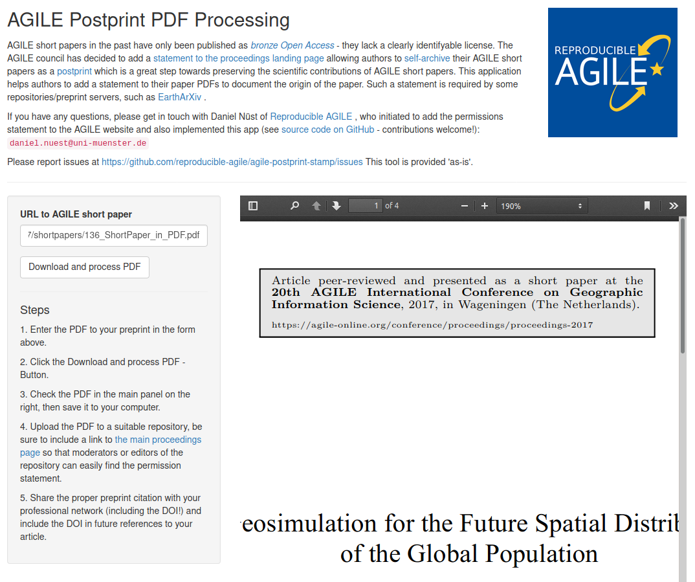

# AGILE Postprint Stamp

[Shiny](https://shiny.rstudio.com/) application for adding a textbox to the first page of an AGILE short paper, so it can be uploaded to public preprint servers or institional repositories.

<!--
## Use app online

👉👉 **https://dnlnst.shinyapps.io/agile-postprint-stamp/** 👈👈
-->



## Use app locally

1. Clone the repositoy
2. Open `app.R` in RStudio
3. Click "Run App"

```r
git2r::clone("reproducible-agile/agile-postprint-stamp")
shiny::runApp("agile-postprint-stamp")
```

The project's dependencies are pinned in the [`renv.lock`](https://rstudio.github.io/renv/articles/lockfile.html) file.

## Deploy app - WORK IN PROGRESS

Shinyapps currently does not have `qpdf`, and the package does not explose the required feature, see https://github.com/ropensci/qpdf/issues/11

```r
library("rsconnect")
rsconnect::deployApp(".", appFiles = c("app.R", "www", "stamp", "renv.lock"))
```

## Contribute

Please note that this project is released with a [Contributor Code of Conduct](https://contributor-covenant.org/version/2/0/CODE_OF_CONDUCT.html).
By contributing to this project, you agree to abide by its terms.

Please report bugs as GitHub issues.

_All contributions welcome!_

## License

Copyright 2020 Daniel Nüst. Project is published under GNU GPL v3 license, see file `LICENSE.md` for details.
